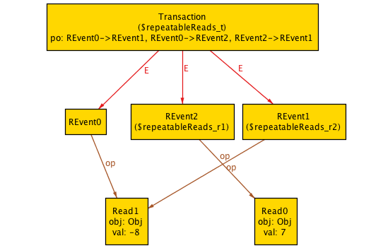
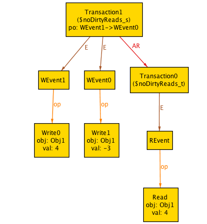

# Reading "A Framework for Transactional Consistency Models with Atomic Visibility" with Alloy

[A Framework for Transactional Consistency Models with Atomic Visibility][1] by Cerone, Bernardi and
Gostman uses an axiomatic specification approach to reason about consistency
models of tranactional databases.

This approach lends itself well to modeling with Alloy, so I thought it would
be useful Alloy practice to translate the specifications into Alloy.

Note that this file itself can be loaded directly into Alloy thanks to [Markdown
support in Alloy 5][2].

## Reads and writes

The paper models reads and write operations like this (from Section 2, page
60):

> Op = {read(x, n), write(x, n) | x ∈ Obj, n ∈ Z}

In Alloy:

```alloy
sig Obj {}

abstract sig Op {
    obj: Obj,
    val: Int
}

sig Read,Write extends Op {}
```

Note: we don't really need to model values as integers, but I chose to do it
anyway.

## Event histories

From Section 2, page 60:

> [W]e denote operation invocations using history events of the form (ι, o), where ι is an identifier from a countably infinite
> set EventId and o ∈ Op

In Alloy, we'll call a history event *HEvent*. We'll also distinguish between
reads and writes.

```alloy
sig EventId {}

abstract sig HEvent {
    id: EventId,
    op: Op,
}{
    // event ids are distinct
    all h : HEvent | (h.@id = id) => h = this
}

sig REvent extends HEvent {
}{
    op in Read
}

sig WEvent extends HEvent {
}{
    op in Write
}
```

> We let WEventx = {(ι, write(x, n)) | ι ∈ EventId, n ∈ Z}, define the set REventx of read events similarly, and
> let HEventx = REventx ∪ WEventx.

WEventx, REventX and HEventX are all parameterized by the object x. To model
this in Alloy, we're going to define functions that takes x as an argument. 

```alloy
fun HEventObj[x : Obj] : HEvent {
	{e : HEvent | e.op.obj = x }
}

fun WEventObj[x : Obj] : WEvent {
	HEventObj[x] & WEvent
}

fun REventObj[x : Obj] : REvent {
	HEventObj[x] & REvent
}

```


## Transactions

From Section 2, page 60:

> **Definition 1.** A *transaction* T, S, . . . is a pair (E, po), where E ⊆ HEvent is a finite,
> non-empty set of events with distinct identifiers, and the program order *po* is a total order
> over E.
 
> **Definition 2.** An abstract execution is a triple A = (H, VIS, AR) where:
> - visibility VIS ⊆ H × H is a prefix-finite, acyclic relation; and
> - arbitration AR ⊆ H × H is a prefix-finite, total order such that AR ⊇ VIS.

We'll create a Transaction model in Alloy that captures both definitions.

```alloy
sig Transaction {
    E : some HEvent,
    po: HEvent -> HEvent,
    VIS: set Transaction,
    AR: set Transaction
}{
    // po is total
    all e1, e2 : E | e1!=e2 => (e1->e2 in po or e2->e1 in po)

    // po is antisymmetric
    no po & ~po

    // po is irreflexive
    no iden & po

    // po only contains events from e
    po in E->E

    // VIS is a subset of AR
    VIS in AR
}

fact eventsBelongToOnlyOneTransaction {
	all e : HEvent | one E.e
}

fact VisIsAcyclic {
	all t : Transaction | t not in t.^VIS
}

fact ArIsAcyclic {
	all t : Transaction | t not in t.^AR
}

fact ArIsTotalOrder {
	no (iden & AR)
	no (AR & ~AR)
	all t1, t2 : Transaction | t1!=t2 => t1->t2 in AR or t2->t1 in AR
}
```


## Repeatable reads 

Here's how the authors *repeatable reads*, from Section 3, p61:

>  if a transaction reads an object twice without writing to it in-between, it will read the same value in both cases.

In Alloy, we can assert all reads are repeatable:

```alloy
assert repeatableReads {
 all t : Transaction, r1,r2 : t.E & REvent |
  // if same object is being read and r1 comes before r2
  ((r1.op.obj = r2.op.obj) and (r1->r2 in t.po) and 
  // and no write after r1 and before r2
   (no w : t.E & WEvent | (w.op.obj = r1.op.obj and ({r1->w} + {w->r2}) in t.po)))
  // then they will read the same value
  => r1.op.val = r2.op.val
}
```

If we check this assertion, Alloy will find a counterexample:

```alloy
// check repeatableReads
```



Note: Here are the theme changes I made to render this:

```
EventId -> Show: Off
obj -> Shows as arcs: Off
obj -> Show as attribute: On
val -> Show as arcs: Off
val -> Show as attribute: Off
Obj -> Show: Off
po -> Show as attribute: On
po -> Show as arcs: Off
```

You can see by the value of po that the ordering was: 

1. REvent0
1. REvent2
1. REvent1

REvent0 and Revent1 both read -8, but REvent2 read 7, and there was no
intervening write.


## Internal consistency

If we enforce the *internal consistency axiom*, then this ensures repeatable
reads.

The axiom, called INT, is defined in Section 3, Figure 2, page 63:

> ∀(E, po) ∈ H. ∀e ∈ E. ∀x, n.(e = (_, read(x, n)) ∧ (po−1 (e) ∩ HEventx ≠ ∅)) ⇒  maxpo(po−1 (e) ∩ HEventx) = (_, _(x, n)) 

First, we need to define maxpo, which is the last operation specified by the relation
po. 

The function maxR, from some relation R, is defined on page 61:

> let maxR(A) be the element u ∈ A such that ∀v∈A.v=u ∨ (v,u)∈R; if A=∅, then maxR(A) is undefined. 

We'll also need min later, so we'll define them both here: 

```alloy
fun max[R : HEvent->HEvent, A : set HEvent] : HEvent {
	// the element u \in A s.t.
	// all v in A. v = u or (v,u) in R
	{u : A | all v : A | v=u or v->u in R }
}

fun min[R : HEvent->HEvent, A : set HEvent] : HEvent {
	{u : A | all v : A | v=u or u->v in R }
}
```

We can now define INT, as well as some helper methods that it uses. Note that
we use Transaction to specify the set of transactions in the universe, where
the paper uses "H".

```alloy
fact INT {
 all t : Transaction, e : t.E, x : Obj, n : Int |
  // previous op that accessed x
  let prevOpX = max[t.po, ~(t.po).e & HEventObj[x]].op | 
   (reads[e.op, x, n] and some ~(t.po).e & HEventObj[x]) => accesses[prevOpX, x, n]
}

// True if op reads n from x or writes n to x
pred accesses[op : Op, x : Obj, n : Int] {
    op.obj=x and op.val=n
}

// True if op reads n from x
pred reads[op : Op, x : Obj, n : Int] {
    op in Read and accesses[op, x, n]
}
```
With the INT axiom specified as a fact, if we check our assertion, Alloy tells
us:

```
Executing "Check repeatableReads"
   Solver=minisatprover(jni) Bitwidth=4 MaxSeq=4 SkolemDepth=1 Symmetry=20
   7404 vars. 159 primary vars. 22398 clauses. 157ms.
   No counterexample found. Assertion may be valid. 194ms.
   Core. contains 12 top-level formulas. 19ms.
```

## Dirty reads 

The authors define the absence of *dirty reads* in Section 3, p61:

> a committed transaction cannot read a value written by an aborted or an
> ongoing transaction (which are not present in abstract
> executions), and a transaction cannot read a value that was overwritten by the
> transaction that wrote it.

```alloy

fun committedWrite[t : Transaction, x : Obj] : set Int {
    max[t.po, t.E & WEventObj[x]].op.val
}

fun overwrittenWrites[t : Transaction, x : Obj] : set Int {
    (t.E & WEventObj[x]).op.val - committedWrite[t, x]
}


assert noDirtyReads {
/*
For all objects x, there is no transaction where:
- there are no writes to x
- the read from x yields a dirty value

- Committed values: last write to x in a transaction
- All values: all values ever written to x
- Dirty values: committed - all
*/
all x : Obj | no t : Transaction |
 // no writes to x in t
 (no t.E & WEventObj[x]) and 
 // a read in t corresponds to a dirty write in x
 // we special-case 0 because a 0 read can legitimately occur from transactions that go
 // before any other ones commit a write
 (some s : Transaction |  some ((t.E & REventObj[x]).op.val & overwrittenWrites[s, x]) - {0})
}

check noDirtyReads
```

Checking this assertion, Alloy finds a counterexample:



In this counterexample, Transaction1 writes 4 and then overwrites -3 to Obj1,
but Transaction0 reads 4.

## External Consistency

To prevent dirty reads, the authors introduce the *external consistency axiom*, EXT, in Section 3, page 61:

> If a read is not preceded in the program order by an operation on the same object,
> then its value is determined in terms of writes by other transactions using the *external consistency axiom* EXT.

EXT is formally defined on page 63, Figure 2:

> ∀T ∈ H. ∀x, n. T ⊢ Read x : n ⇒
> ((VIS−1 (T) ∩ {S | S ⊢  Write x : _} = ∅ ∧ n = 0) ∨
> maxAR(VIS−1 (T) ∩ {S | S ⊢ Write x : _}) ⊢  Write x : n)

This definition uses two new definitions:

> let T ⊢ Write x : n if T writes to x and the last value written is n: maxpo(E ∩ WEventx) = (_, write(x, n)). 

> let T ⊢ Read x : n if T makes an external read from x, i.e., one before writing to x, and n is the value returned by the first such read: minpo(E ∩ HEventx) = (_, read(x, n))

In Alloy:

```alloy
fact EXT {
	all t : Transaction |
		all x : Obj |
			all n : Int |
				TReads[t, x, n] => 
					let WritesX = {s : Transaction | (some m : Int | TWrites[s, x, m]) } |
					(no (VIS.t & WritesX) and n=0) or TWrites[(maxAR[VIS.t & WritesX]), x, n]
}

// In transaction t, the last write to object x was value n
pred TWrites[t : Transaction, x : Obj, n : Int] {
	let lastWriteX = max[t.po, t.E & WEventObj[x]].op |
		lastWriteX in Write and lastWriteX.obj=x and lastWriteX.val=n
}

// In transaction t, the first access to object x was a read of value n
pred TReads[t : Transaction, x : Obj, n : Int] {
	let firstOpX = min[t.po, t.E & HEventObj[x]].op |
		firstOpX in Read and firstOpX.obj=x and firstOpX.val=n
}

// The last transaction to occur in the ordering given by AR
fun maxAR[T: set Transaction] : Transaction {
	{t : T | all s : T | s=t or s->t in AR}	
}
```

Once this fact is included, Alloy can no longer find a counterexample for the
noDirtyReads assertion.


[1]: http://drops.dagstuhl.de/opus/volltexte/2015/5375/pdf/15.pdf 
[2]: https://github.com/AlloyTools/org.alloytools.alloy/wiki/5.0.0-Change-List#markdown-syntax
